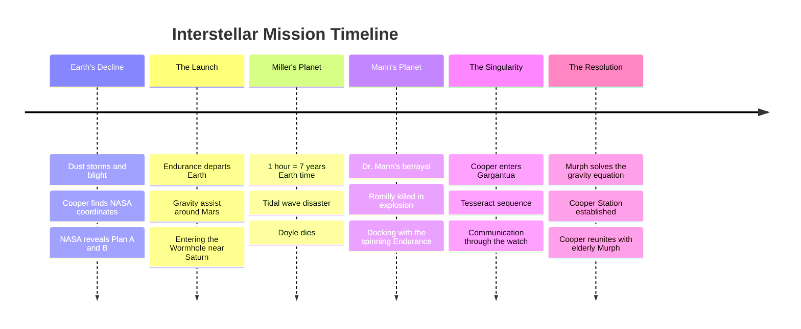

import { Image } from 'astro:assets';
import cooperJourney from '~/assets/blog/interstellar/Odyssey-Through-Gargantua-The-Endurance-Mission-Timeline.webp';

While Cooper returned to civilization, Amelia Brand went to the final planet.

## Plan B

She sets up the camp, executing Plan B to ensure the survival of the species via population bomb.

## The Reunion?

The movie ends with Cooper stealing a ship to go find her. Acknowledging that she is out there, alone, in a new galaxy.

## Chronological Timeline

<Image src={cooperJourney} alt="a desperate interstellar mission to save humanity from an ecological collapse on Earth. " />

## Further Reading

Lorem ipsum dolor sit amet, consectetur adipiscing elit. Sed do eiusmod tempor incididunt ut labore et dolore magna aliqua. Ut enim ad minim veniam, quis nostrud exercitation ullamco laboris nisi ut aliquip ex ea commodo consequat. Duis aute irure dolor in reprehenderit in voluptate velit esse cillum dolore eu fugiat nulla pariatur. Excepteur sint occaecat cupidatat non proident, sunt in culpa qui officia deserunt mollit anim id est laborum.

