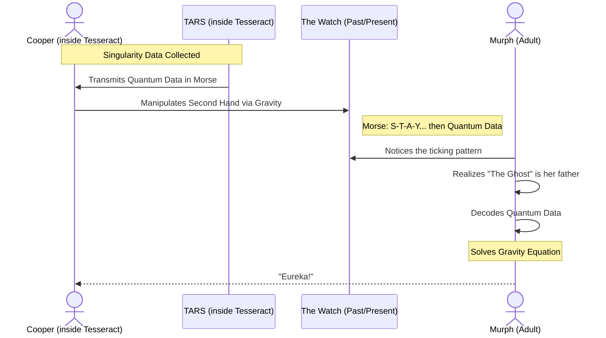

import { Image } from 'astro:assets';
import fifthDimension from '~/assets/blog/interstellar/fifth-dimension.webp';

In the Tesseract, time was represented as infinite physical rooms.

<Image src={fifthDimension} alt="Cooper inside the Tesseract. " />

## Gravity as a Pen

Cooper could exert force across time using gravity. Moving the books, the watch hand, the dust.

## Closing the Loop

He realized he was his daughter's "ghost" all along.

## Inter-dimensional Communication (Sequence)

## Further Reading

Lorem ipsum dolor sit amet, consectetur adipiscing elit. Sed do eiusmod tempor incididunt ut labore et dolore magna aliqua. Ut enim ad minim veniam, quis nostrud exercitation ullamco laboris nisi ut aliquip ex ea commodo consequat. Duis aute irure dolor in reprehenderit in voluptate velit esse cillum dolore eu fugiat nulla pariatur. Excepteur sint occaecat cupidatat non proident, sunt in culpa qui officia deserunt mollit anim id est laborum.

