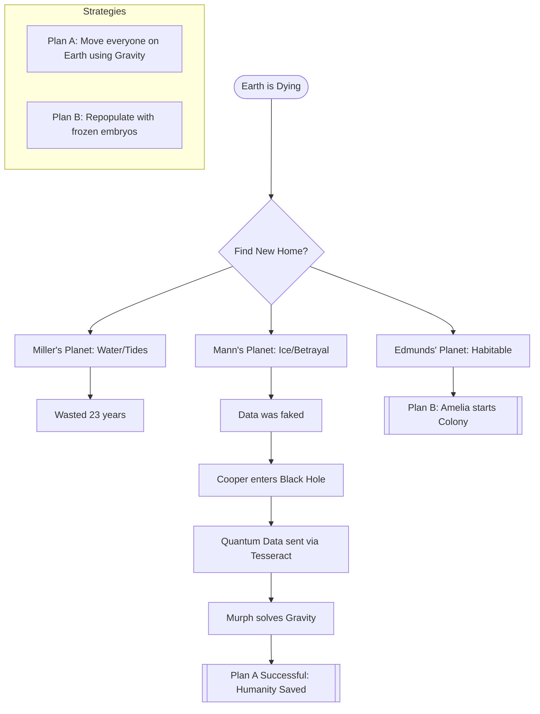

import { Image } from 'astro:assets';
import ghostMessage from '~/assets/blog/interstellar/The-Ghost-Quantum-Time-Message.webp';

To save Brand and the mission, Cooper had to detach.

## Into the Dark

Falling into a black hole was a suicide mission, or so he thought.

<Image src={ghostMessage} alt="Ghost Message." />

## The Data

He gathered the quantum data needed to solve the gravity equation, proving that his detachment was the only way to save Earth.

## Mission Strategy Flowchart

## Further Reading

Lorem ipsum dolor sit amet, consectetur adipiscing elit. Sed do eiusmod tempor incididunt ut labore et dolore magna aliqua. Ut enim ad minim veniam, quis nostrud exercitation ullamco laboris nisi ut aliquip ex ea commodo consequat. Duis aute irure dolor in reprehenderit in voluptate velit esse cillum dolore eu fugiat nulla pariatur. Excepteur sint occaecat cupidatat non proident, sunt in culpa qui officia deserunt mollit anim id est laborum.

