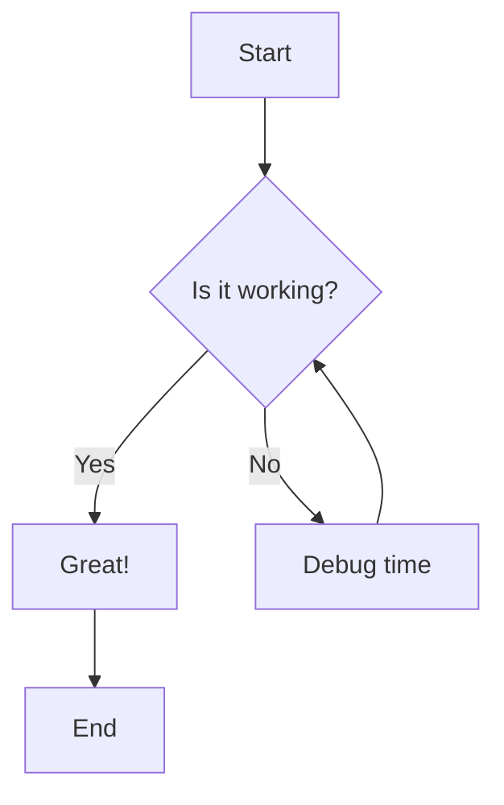
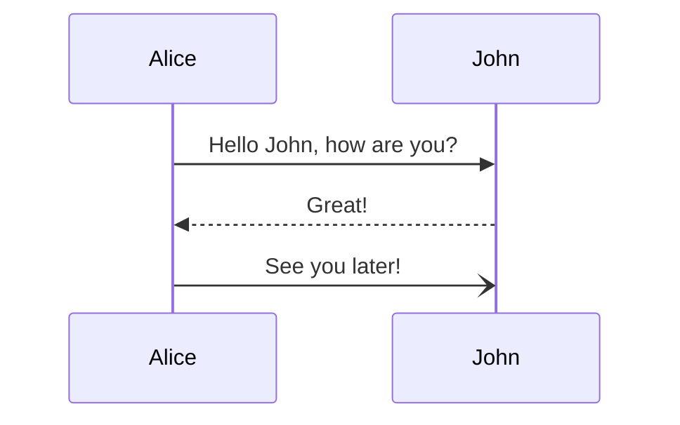

import ComponentPreview from '~/components/docs/ComponentPreview';
import { YouTube, Tweet, LinkPreview } from 'astro-embed';

MDX allows you to use JSX (components) in your Markdown content. This provides a powerful way to create interactive and dynamic documentation and blog posts.

## Frontmatter

Every MDX file should start with a frontmatter block. This block contains metadata about the page.

```yaml
---
title: My Awesome Page
description: A short description of the page.
order: 1 # Optional: Used for sorting in sidebar
noindex: false # Optional: Set to true to hide from search engines
nofollow: false # Optional: Set to true to tell search engines not to follow links
---
```

## Basic Markdown

You can use all standard Markdown syntax:

- **Bold** and *Italic* text.
- [Links](https://astro.build) and images.
- Lists and quotes.
- Code blocks with syntax highlighting.

## Mermaid Diagrams

You can now use Mermaid diagrams directly in your MDX/Markdown files!

### Flowchart example

<ComponentPreview client:load code={`\`\`\`mermaid
graph TD;
    A[Start] --> B{Is it working?};
    B -- Yes --> C[Great!];
    B -- No --> D[Debug time];
    C --> E[End];
    D --> B;
\`\`\``}>

</ComponentPreview>

### Sequence Diagram example

<ComponentPreview client:load code={`\`\`\`mermaid
sequenceDiagram
    Alice->>John: Hello John, how are you?
    John-->>Alice: Great!
    Alice-)John: See you later!
\`\`\``}>

</ComponentPreview>

## Social & Media Embeds

You can easily embed YouTube videos, Tweets, and Link Previews using the `astro-embed` library.

### YouTube Videos

To embed a YouTube video, use the `YouTube` component with the video ID.

<ComponentPreview client:load code={`import { YouTube } from 'astro-embed';

<YouTube id="rRxuVOutmFQ" />`}>
<YouTube id="rRxuVOutmFQ" />
</ComponentPreview>

### Tweets

You can embed Tweets by providing the URL of the tweet.

<ComponentPreview client:load code={`import { Tweet } from 'astro-embed';

<Tweet id="https://x.com/astrodotbuild/status/1995089772826829031" />`}>
<Tweet id="https://x.com/astrodotbuild/status/1995089772826829031" />
</ComponentPreview>

### Link Previews

Create rich card previews for any URL.

<ComponentPreview client:load code={`import { LinkPreview } from 'astro-embed';

<LinkPreview id="https://astro.build/" />`}>
<LinkPreview id="https://astro.build/" />
</ComponentPreview>

## Using Components

You can import and use Astro components directly in your MDX files.

```mdx
import { Badge } from '~/components/ui/Badge.astro';

<Badge variant="primary">New Feature</Badge>
```

## Tips for Blog Posts

1. **Hero Images**: Include a `heroImage` in your frontmatter for better visual appeal.
2. **Excerpts**: The first few paragraphs are usually used as the excerpt in the blog list.
3. **SEO**: Ensure your `description` is concise and contains relevant keywords.
4. **Interactive Demos**: Use React islands (`client:load`) for complex interactive elements.

## Components Registry

You can use our pre-built components to enhance your content:

- `Badge`: For status or categories.
- `Card`: For grouped content.
- `ComparisonTable`: For comparing features.
- `Timeline`: For roadmaps or history.
- `TechStack`: For showing technologies used.
